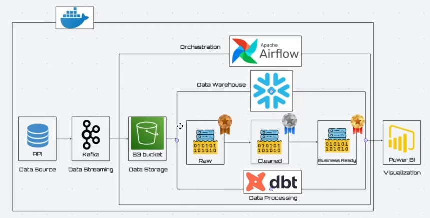

Realtime Stock Data Engineering Project


📌 Overview

This project implements an end-to-end real-time data engineering pipeline for stock market data. The system ingests real-time stock quotes, processes and transforms data using modern DE tools, and serves analytics-ready datasets for visualization.

The project is designed to demonstrate production-style Data Engineering skills including streaming ingestion, orchestration, transformation modeling, and analytics consumption.

📊 Data Overview

The dataset consists of real-time stock market data ingested from an external API in JSON format, where each record represents a snapshot of a stock symbol at a specific point in time. The raw data includes key pricing fields such as current price, daily high/low, opening price, and timestamp. This data is first stored in its original form (Bronze layer) to ensure traceability, then parsed and standardized into structured columns (Silver layer) with proper data types. In the Gold layer, the data is transformed into analytics-ready models, including latest snapshots per symbol for KPI tracking and aggregated daily OHLC (Open, High, Low, Close) metrics for trend analysis. Overall, the dataset evolves from flexible raw JSON into clean, structured, and business-ready tables optimized for analytical queries and dashboard visualization.

🏗️ Architecture



Data Flow:
```
Stock API
│
▼
Kafka
│
▼
MinIO (Raw / Bronze)
│
▼
Snowflake(Raw)
│
▼
dbt run
│
▼
Snowflake(Bronze → Silver → Gold)
│
▼
Apache Superset (Dashboard)
```

🧰 Tech Stack
```
Programming Language: Python

Streaming: Apache Kafka

Orchestration: Apache Airflow

Object Storage: MinIO (S3-compatible)

Data Warehouse: Snowflake

Transformation: dbt (Bronze / Silver / Gold layers)

Visualization: Apache Superset

Containerization: Docker & Docker Compose
```
